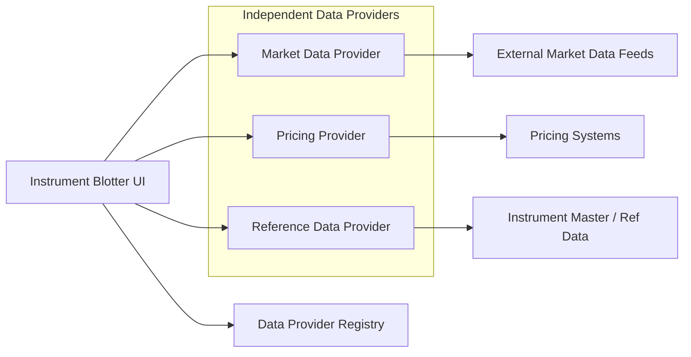
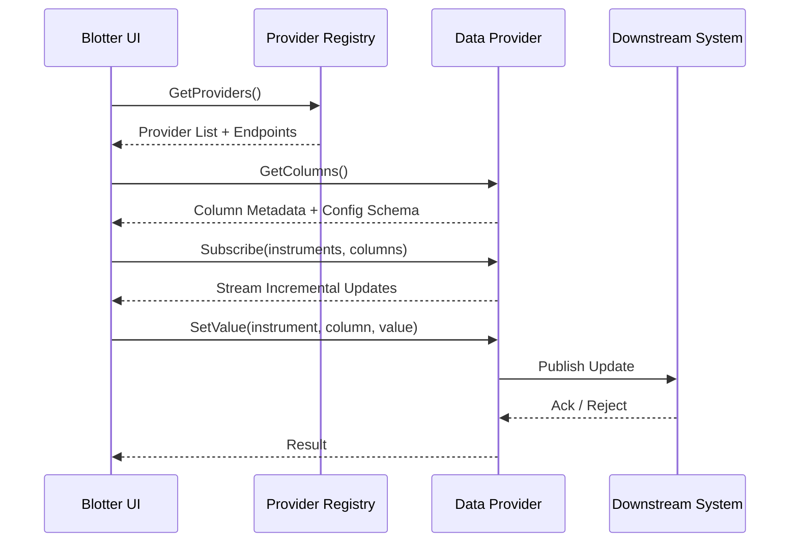
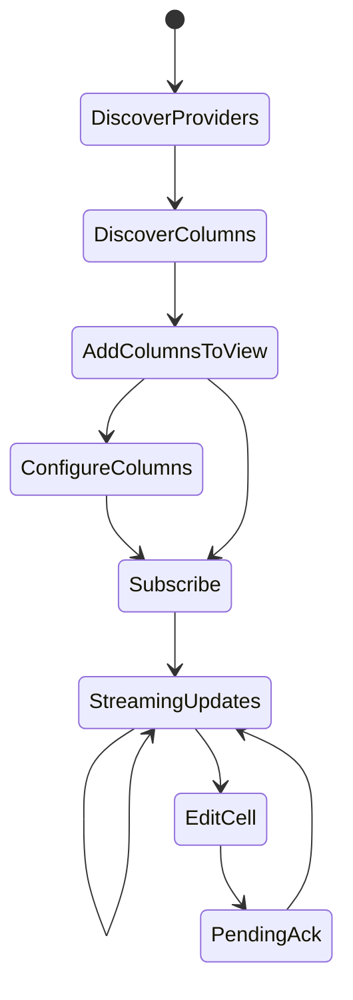

# Instrument Blotter – Technical Design Overview

## 1. Introduction & Motivation

The Instrument Blotter is a core trading-desk application used in a fixed-income (bond) trading environment.  
It provides traders with a **single, real-time, grid-based view** of all instruments they are responsible for.

Each row represents an instrument, while columns represent a wide variety of data:
- Market data sourced from external venues
- Internal pricing and analytics
- Reference data
- Trading controls (e.g. pricing model, spread)

A key challenge is that **different columns are owned by different teams and systems**, each with its own lifecycle, deployment cadence, and failure modes.

This design aims to:
- Decouple the frontend from backend ownership
- Enable independent development and deployment
- Improve resilience by isolating failures to specific column groups

---

## 2. Design Goals

The primary goals of the design are:

- Runtime discovery of data providers and columns
- Strong decoupling between UI and backend systems
- Independent ownership and deployment of column providers
- Failure isolation at provider / column-group level
- Support for high-frequency, streaming data
- Limited, explicit support for bidirectional (write-back) columns
- Backend technology agnosticism

---

## 3. System Overview

The system is composed of a small number of well-defined components that interact through stable APIs.

### Primary Components

| Component | Responsibility |
|---------|----------------|
| Blotter UI | Grid rendering, subscriptions, user interaction |
| Data Provider Registry | Runtime discovery of data providers |
| Data Providers | Column ownership, streaming data, write-back logic |
| Downstream Systems | Market data, pricing engines, risk systems |

### Logical Architecture (Protocol-Agnostic)

---

## 4. Frontend Architecture

The Blotter UI is a web-based application built around a high-performance, virtualised grid.

### Responsibilities
- Query the Data Provider Registry
- Discover providers and column definitions dynamically
- Render columns based on provider-supplied metadata
- Manage real-time subscriptions
- Handle user edits for bidirectional columns

### Key Principle
The frontend acts as a **composition layer**, not a business logic layer.  
All column semantics and behaviour are defined by providers.

---

## 5. Data Provider Registry

The Data Provider Registry is a lightweight discovery service exposed at a well-known URL.

### Responsibilities
- Maintain a list of registered providers
- Expose provider identifiers, descriptions, and endpoints

### Non-Responsibilities
- No data aggregation
- No proxying of runtime data
- No coupling to provider health or availability

The registry enables the UI to remain completely decoupled from specific backend implementations.

---

## 6. Data Provider Model

Each Data Provider is an independently deployable service responsible for a logical group of columns.

### Ownership Model
- One team owns each provider end-to-end
- The provider owns:
  - Column definitions and semantics
  - Data sourcing and transformation
  - Streaming update logic
  - Write-back adaptation into downstream systems

### Technology
- Providers may be implemented in any language or stack
- The API contract is the sole coupling point

---

## 7. Column Discovery & Metadata

Each provider exposes a **Column Definition API** describing all columns it supports.

### Column Metadata Includes
- Column identifier and display name
- Category / grouping
- Data type
- Formatting hints
- Editability
- Allowed values or enums (where applicable)
- Optional configuration schema

This enables:
- Fully dynamic column rendering
- Context-sensitive configuration panels
- Minimal UI-side conditional logic

---

## 8. Data Flow & Interaction Patterns

### Subscription Model (Read Path)

- The UI subscribes to:
  - A set of instruments
  - A set of columns
- Providers push incremental updates for subscribed data
- Subscriptions are mutable at runtime:
  - Columns can be added or removed
  - Instruments can be added or removed

Default behaviour:
- Read-only
- Push-based
- High-frequency

---

## 9. Bidirectional Columns (Write Path)

A small subset of columns supports user-driven updates.

### Typical Examples
- Pricing model selection
- Spread or price adjustment

### Interaction Flow
1. User edits a cell in the grid
2. UI sends a SetValue request to the provider
3. Provider validates and translates intent
4. Provider publishes the update into downstream systems
5. Provider returns an acknowledgement or rejection
6. UI reflects the outcome visually

Bidirectional behaviour is **explicit, limited, and isolated**.

---

## 10. Interaction Diagram (Lightly Technical)

---

## 11. Column Lifecycle

---

## 12. Performance & Scaling Considerations

The design assumes:
- Very high update volumes
- Low-latency expectations
- Partial failures are normal

Architectural mitigations include:
- Provider-level isolation
- Incremental cell-level updates
- Grid virtualisation in the UI
- Subscription scoping to visible data

Detailed performance tuning is deferred to later phases.

---

## 13. Trade-offs & Open Questions

### Trade-offs
- Increased service count and operational complexity
- Requires disciplined API versioning and governance

### Open Questions
- Final transport/protocol choice
- Schema evolution strategy
- Cross-provider aggregation requirements

